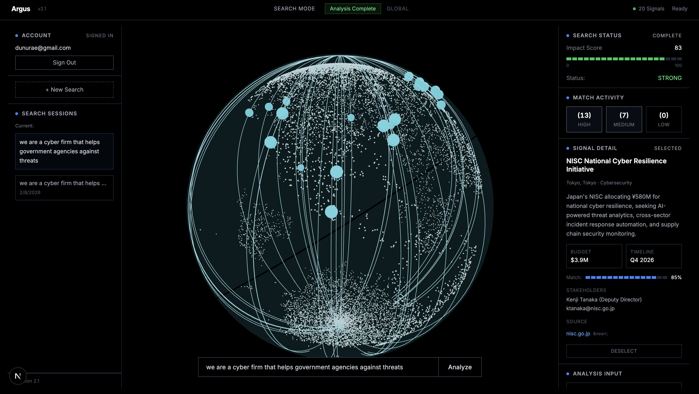
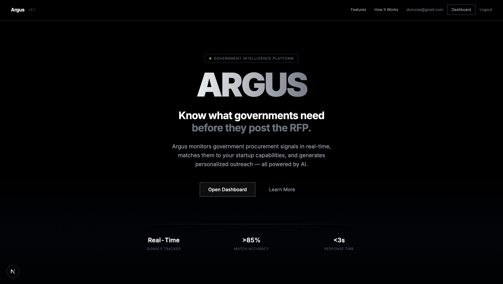

# Argus

Argus is a GovTech intelligence platform that helps startups surface government opportunities before they hit the RFP stage. A user describes their startup, the backend collects live signals with caching and fallback, and the UI ranks the best matches on a globe with clear, actionable details.

Like to see our project? Click here: https://devpost.com/software/argus-uipa2c

## 🚀 Features

- Startup → signal matching (semantic + keyword hybrid, with keyword‑only fallback).
- Live signal collection on `/match` with cache + file fallback.
- Futuristic HUD UI with globe pins and detail panels.
- Persistent pins between searches (localStorage).
- Firebase email/password auth (optional).
- Scraping pipeline feeds live signals at runtime.

## 🧰 Tech Stack

- **Frontend:** Next.js (App Router), React, Tailwind CSS, Three.js, Framer Motion
- **Backend:** FastAPI, Uvicorn, Gemini API (embeddings + generation), scikit‑learn
- **Auth:** Firebase

## 📸 Screenshots




## 💨 Quick Start

### Backend

```bash
cd backend
python3 -m venv .venv
source .venv/bin/activate
pip install -r requirements.txt
uvicorn main:app --reload --port 8000
```

### Frontend

```bash
cd frontend
npm install
npm run dev
```

Open `http://localhost:3000`.

## 🧪 Environment Setup

### Backend env (.env at repo root)

Create a root `.env` from `.env.example`:

```
GOOGLE_API_KEY=...
```

The backend loads this with `find_dotenv()`.

### Frontend env (frontend/.env)

Next.js only auto‑loads env files from the frontend app directory. Create `frontend/.env` with:

```
NEXT_PUBLIC_API_URL=http://127.0.0.1:8000
```

If you use Firebase Auth, add:

```
NEXT_PUBLIC_FIREBASE_API_KEY=...
NEXT_PUBLIC_FIREBASE_AUTH_DOMAIN=...
NEXT_PUBLIC_FIREBASE_PROJECT_ID=...
NEXT_PUBLIC_FIREBASE_STORAGE_BUCKET=...
NEXT_PUBLIC_FIREBASE_MESSAGING_SENDER_ID=...
NEXT_PUBLIC_FIREBASE_APP_ID=...
```

## 🔌 API Endpoints

- `GET /health` → `{status: "ok"}`
- `POST /match` → matches for a startup description
- `POST /email` → draft outreach email (requires Gemini)

## 🧠 Matching Flow (Runtime)

```
User input
   ↓
Collect live signals (search → read → extract) or cache/fallback
   ↓
Embedding + keyword overlap (Gemini if available)
   ↓
Filter by MIN_MATCH_SCORE
   ↓
Return top matches → globe pins
```

## 🛰️ Scraping Pipeline (Live)

Script: `backend/scrape_signals.py` (invoked by `/match` via `collect_signals`).

Pipeline:

```
Serper (search) → Jina (read/clean) → Gemini (extract signals)
```

Fallback order:

1. Live scrape → results
2. Cache (if recent)
3. File fallback (`signals.json`) when enabled

## 🗂️ Project Structure

```
Argus/
├── backend/
│   ├── main.py
│   ├── requirements.txt
│   ├── scrape_signals.py
│   └── data/
│       ├── signals.json
│       ├── startups.json
│       └── sources.json
├── frontend/
│   ├── app/
│   ├── components/
│   ├── lib/
│   ├── package.json
│   └── tsconfig.json
├── README.md
├── .env.example
└── PLAN.md
```

## 👥 Contributors

- Dunura Epasingag
- Raihan Carder
- Fatima Rehan
- Akshay Krishna Sirigana

## 📝 Notes

- If Gemini is down or misconfigured, `/match` falls back to keyword‑only matching.
- Frontend will 404 if you open backend URL (`:8000`). Use `:3000` for UI.

## 🔭 Future Goals

- Add database to store users past data on the cloud.
- Smarter matching with richer embeddings and feedback loops.
- Add outreach workflows (email approval + CRM export).
